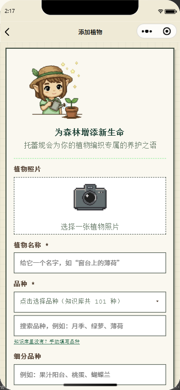
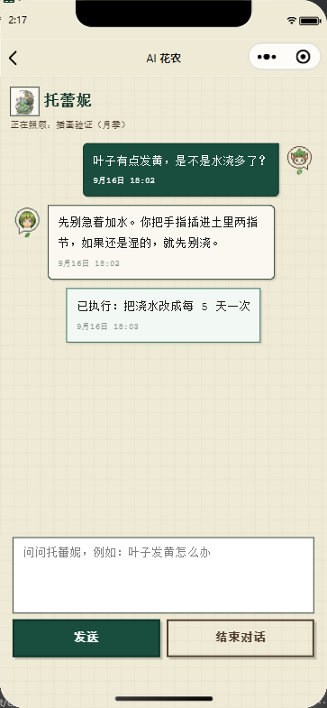

# Treyni · 托蕾妮

**An AI-assisted plant-care WeChat Mini Program — care reminders that adapt to what you actually did, photo-based pest & disease diagnosis, and a conversational gardener that remembers your plant's history.**

<sub>中文说明见 [README.zh-CN.md](README.zh-CN.md)</sub>

---

## What it is

Treyni is a WeChat Mini Program for home gardeners and school gardening clubs. It keeps a
per-plant record (species, pot, soil, light, location), schedules daily care reminders
(watering / fertilizing / pesticide / pruning / repotting), and uses an LLM to turn those
reminders into concrete, step-by-step operating plans — then asks you what you *actually*
did, and re-schedules the next round from that answer.

It is not a chat wrapper around a garden database. The interesting part is the feedback
loop: every reminder carries a frozen scheduling threshold, a soil-water balance, and a
completion record, and the next reminder is derived from those — never from a fixed
interval or from the moment you tapped a button.

**Status:** in development, version 0.1.0, targeting WeChat review. Running against a
self-hosted Node backend (no cloud dependency other than the LLM + weather APIs).

## Screenshots

| Add a plant | AI gardener chat |
| --- | --- |
|  |  |

More screenshots (garden, plant detail, reminder detail with operating plan, diagnosis,
care report) are being re-captured against a clean demo dataset — see
[docs/screenshots/README.md](docs/screenshots/README.md).

## Features

**Plant records**

- Per-plant profile: species and cultivar (searchable against a local knowledge base),
  pot size, substrate, light, location, source, planting date, photo.
- Garden page aggregates "what needs doing next" across all plants.
- Plant knowledge base: 60+ species, care groups, planting-condition guides.

**Reminder engine**

- Four recurring care types plus event-driven repotting and user-defined plans.
- Watering intervals derived from a soil-water balance model fed by pot size, substrate
  and weather — not a fixed "water every 3 days".
- Overdue reminders shift colour on a 7-day gradient, so "a bit late" and "way too late"
  look different at a glance.
- A one-off plan is either in scope (it changes the daily schedule) or out of scope (it is
  just a record) — the classifier only lives on the server, never duplicated in the client.

**AI layer**

- Photo-based pest & disease diagnosis (leaf upload → identification → treatment plan),
  with a pesticide-safety pass that refuses or re-routes unsafe suggestions.
- "Operating plan" generation: a reminder becomes a numbered, icon-annotated plan with
  amounts, timings, and the pitfalls specific to that plant and season.
- Conversational gardener that can act on the schedule ("the soil is still damp, push
  watering back") and echoes every executed change back as a system bubble.
- Care report: a generated summary of the plant's history and what to watch next.

**Feedback loop (the part that matters)**

- Completing a reminder opens a panel that asks what you actually used/watered with.
  "I can't tell" is always available and is recorded as *unregistered* — the system never
  pretends you followed the plan.
- The next reminder is computed from the **actual date the work happened**, with a guard
  that it can never be scheduled in the past.
- Undo restores a whole-row snapshot, so new fields are covered automatically.

## Technical highlights

| Concern | How it works |
| --- | --- |
| Scheduling thresholds | Frozen into `plant_reminders.meta_json.timing` when the reminder is generated, read (never recomputed) at completion time. Only a real plan change re-freezes them. |
| Soil water | A water-balance account: `baseline − days × daily_loss`, stored in `meta_json` so it needed no schema migration. Updated from the UI, from plan regeneration feedback, or from chat via keyword detection. |
| AI cost / latency | Per-section thinking budget (low/high) sharing the `max_tokens` allowance, with an automatic non-thinking retry if the budget is exhausted. Observed 1.4 s → 32 s per section, all under a 60 s ceiling. |
| AI observability | Every call appends provider, model, thinking level, latency, token usage and a `promptHash` (system message only) to `ai_metrics.jsonl`. Changing a prompt is detectable per feature. |
| AI output safety | Candidate lists are produced per reminder and stored server-side, so the completion panel never guesses. Malformed JSON with raw control characters (a real failure mode of long Chinese generations) is repaired before parsing. |
| Auth | `wx.login` → server token. A 401 triggers a silent re-login and one replay of the original request, single-flighted so concurrent 401s produce one login. |
| Networking | The backend advertises its current LAN address into a generated file at boot; the client probes known addresses on failure, switches to whichever answers `/health`, tells the user it did, and replays the request. |
| Verification | 29 named regression scripts (`tools/uitest/verify-*.js`) plus ~90 walkthrough/screenshot scripts; UI layout is asserted by measuring boxes in the render layer (`boundingClientRect`) rather than by eyeballing screenshots. |

## Architecture

```text
WeChat Mini Program (Treyni/)                    Backend (server/)                 External
┌──────────────────────────────┐   HTTPS   ┌─────────────────────────────┐
│ 11 pages / 7 components      │ ────────▶ │ Express 5 + SQLite (16 tbl) │ ──▶ DeepSeek (chat + vision)
│ utils/request.js (retry,     │  Bearer   │ routes/  (12)               │ ──▶ QWeather (watering model)
│   LAN failover, 401 recovery)│ ◀──────── │ services/ (27)              │ ──▶ Baidu plant recognition
│ utils/session.js (wx.login)  │   JSON    │ knowledge/ (JSON, in-repo)  │ ──▶ WeChat login / subscribe msg
└──────────────────────────────┘           └─────────────────────────────┘
        static assets: Treyni/assets (pixel illustration set, generated + quantized)
```

The knowledge base is data, not code: `server/data/knowledge/*.json` holds species,
daily-care rules, fertilizing rules and products, pesticides and diseases, and a purchase
guide. The server assembles the relevant slices into prompts; nothing is hardcoded in the
client.

## Repository layout

```text
Treyni/                  WeChat Mini Program project root (open this in WeChat DevTools)
  pages/  components/   11 pages, 7 custom components (bottom-sheet family, ai-text, undo-bar …)
  utils/                request/session/config/overdue/icons/weather helpers
  assets/               generated pixel-art icons and illustrations (see assets/README.md)
server/                  Node 22 + Express 5 backend
  src/routes/           12 route modules (auth, plants, reminders, journals, diagnosis, chat, …)
  src/services/         27 service modules (scheduling, water model, AI adapter, plan, …)
  data/knowledge/       care knowledge base (JSON)
tools/uitest/           regression + walkthrough scripts (~90 files, 29 named verifiers)
docs/                   how this was built, screenshots
start-server.cmd         one-click backend launcher (Windows)
```

## Getting started

**Backend**

```bash
cd server
npm install
cp .env.example .env      # fill in your own keys
npm start                 # http://127.0.0.1:3000  (GET /health)
```

The SQLite schema is created on first boot. AI, weather and plant-recognition features
need their own API keys in `.env`; everything else runs without them.

**Mini Program**

1. Open `Treyni/` in WeChat DevTools.
2. Set your own AppID in `project.config.json` (the committed value is a placeholder).
3. For simulator runs, `urlCheck` can stay off and the client will use
   `http://127.0.0.1:3000`; for a real device, point `utils/config.js` at your machine's
   LAN address (the backend prints the candidate addresses on boot).

**Regression scripts**

```bash
cd tools/uitest
npm install
node verify-reminder-timing.js     # threshold table + freezing
node verify-occurred-at.js         # actual-date scheduling + undo
node verify-water-baseline.js      # soil-water account
node verify-session-recovery.js    # 401 → silent re-login → replay
```

Server-side verifiers need only the backend; UI verifiers additionally need WeChat
DevTools with the automation port open.

## Development timeline

| Date | Milestone |
| --- | --- |
| 2026-07 | Earliest web prototype (a two-person base-practice exercise) — technical validation of the concept |
| 2026-09-08 … 09-14 | Mini Program rebuild: project skeleton, WeChat login, plant CRUD, garden page, reminders, first AI diagnosis flow |
| 2026-09-16 … 09-18 | Icon/illustration pipeline, real-device fixes (WebP decoding, LAN address discovery, session expiry recovery, soil-water baseline) |
| 2026-09-18 … 09-20 | Four-phase reminder rework: tone rules, overdue gradient, bottom-sheet family, completion panel, actual-date scheduling, undo, frozen thresholds, repotting events |
| 2026-09-20 … 09-21 | Two-layer AI candidates, prompt-version fingerprints, purchase-guide tiers, share-to-timeline, regression suite consolidation |
| ongoing | Real-device testing, WeChat review preparation |

All mini-program code in this repository was written by me, against the git history of the
initial prototype above.

## How this was built

The engineering practices behind it — the invariants that must not be broken, the data
model decisions, the AI prompt-contract process and the verification workflow — are
written up in [docs/how-i-built-this.md](docs/how-i-built-this.md).

Short version: I treated the LLM as a component with a contract, not an oracle. Prompts are
versioned and fingerprinted, AI output is parsed defensively and validated against
domain rules, and every rule that matters has a script that can turn red.

## Privacy & data

This repository contains no user data, no API keys and no production database. The
backend stores plant records, journal entries and photos locally in SQLite; nothing is
shared between accounts (per-account row-level filtering on every read).

The plant-care advice is generated by an LLM and is **not** professional agronomic advice.
Pesticide handling in particular must follow the product label and local regulations.

## License

No license is granted for this repository: the source is published for review and
portfolio purposes, and all rights are reserved. The brand name, illustrations and icon
set are part of the project identity. If you would like to use part of it, please ask.

© 2026 BillyYang0628
