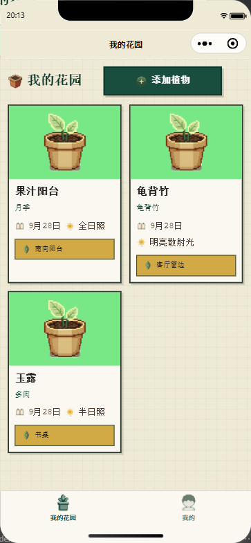
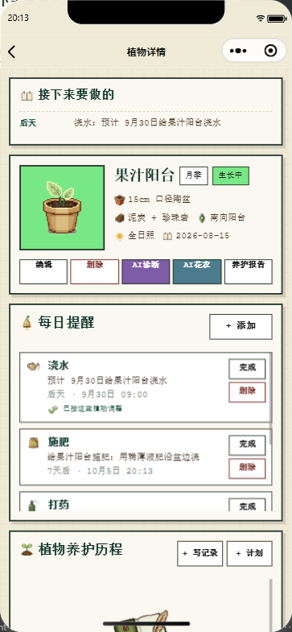
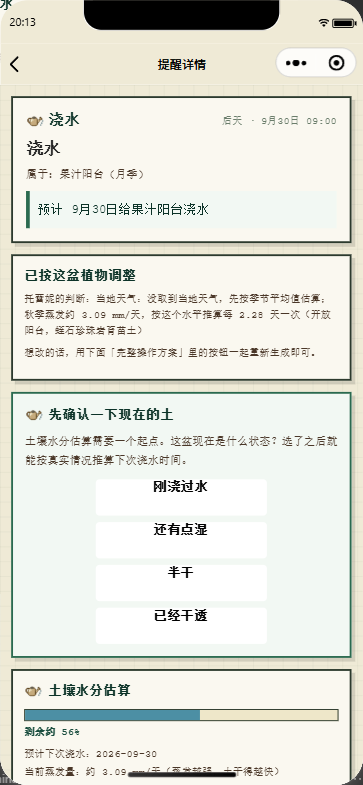
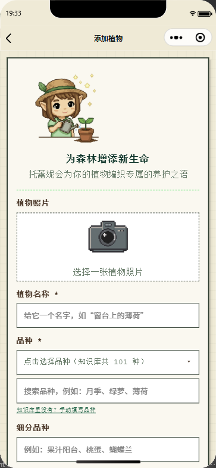
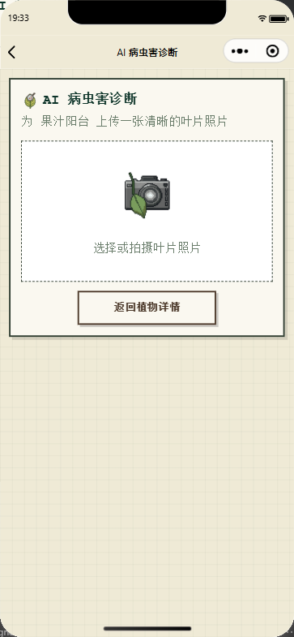
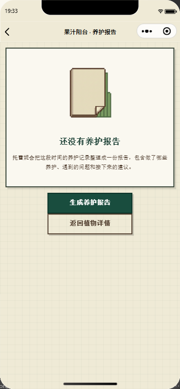
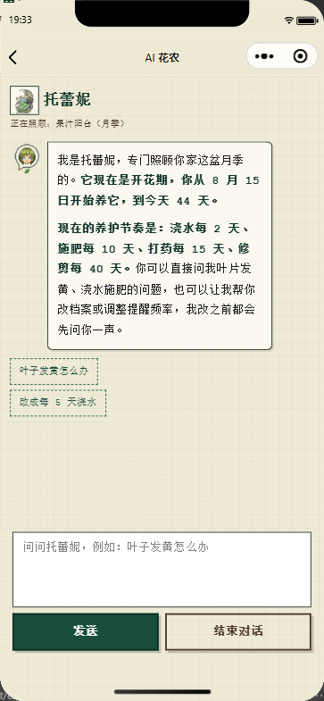
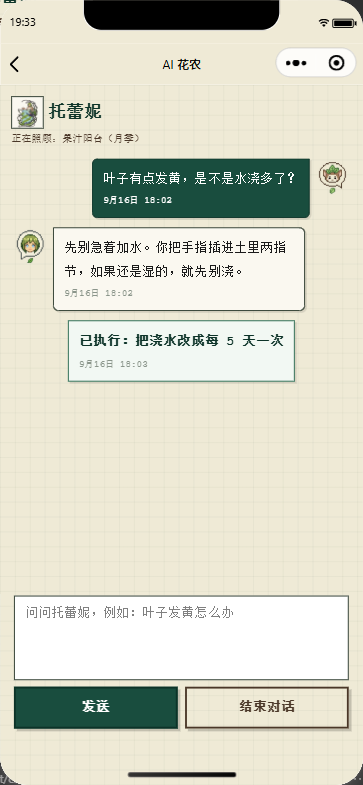

# Treyni · 托蕾妮

**一款 AI 辅助的家庭园艺养护微信小程序 —— 按你「实际做了什么」重排的养护提醒、拍照识别病虫害、以及记得住你这盆花全部经历的花农对话。**

<sub>English: [README.md](README.md)</sub>

---

## 这是什么

托蕾妮面向家庭花友和社团种植劳动实践，为每盆植物建立档案（品种、花盆、土壤、光照、
摆放位置），按天排出浇水 / 施肥 / 打药 / 修剪 / 换盆提醒，并用大模型把每条提醒展开成
可照做的「完整操作方案」——完成后它会问你**实际做了什么**，再按这个回答重排下一轮。

它不是"给园艺数据库套一层聊天壳"。真正有分量的是那条反馈闭环：每条提醒都带着冻结的
排期阈值、土壤水分账户和完成登记，下一轮提醒由这些推导出来，而不是固定间隔、也不是
你点按钮的那一刻。

**当前状态：** 0.1.0，开发中，准备微信提审；后端自建（除大模型与天气接口外无云依赖）。

**使用方式：** 小程序只发给指定使用者。账号由服务端命令行（`tools/admin/create-account.js`）
生成、由管理员私下发放，是进入小程序的唯一途径——没有自助注册，微信登录默认关闭
（`AUTH_ALLOW_WECHAT=false`）。

## 界面

| 我的花园 | 植物档案与每日提醒 |
| --- | --- |
|  |  |
| **提醒详情：按天气调整的方案** | **添加植物** |
|  |  |
| **AI 病虫害诊断** | **一键养护报告** |
|  |  |
| **AI 花农带着这盆植物的上下文开场** | **给建议，并回显已执行的改动** |
|  |  |

截图由 `miniprogram-automator` 驱动真机模拟器拍摄，发布前逐张做过视觉复核（见
[docs/screenshots/README.md](docs/screenshots/README.md)）。

## 功能

**植物档案**

- 每盆植物：品种与细分品种（可在本地知识库里检索）、花盆、基质、光照、位置、来源、
  种植日期、照片。
- 花园页把「接下来要做的」聚合成一张卡，一屏看完所有植物。
- 物种知识库：60+ 品种、养护分组、种植条件速查。

**提醒引擎**

- 四类循环养护 + 换盆这类事件型 + 用户自定义计划。
- 浇水间隔来自「土壤水分账户」（花盆尺寸、基质、天气），不是写死的"每 3 天"。
- 逾期提醒按 7 天色阶渐变，"晚了一点"和"晚太多"一眼能分开。
- 一次性计划严格区分「四类以内」（会改每日提醒）和「四类以外」（只记一条），
  分类规则只有服务端一份，前端不复制。

**AI 层**

- 拍照识别病虫害（叶片上传 → 判断 → 防治方案），中间过一遍用药安全校验，
  不安全的建议会被拦下或改写。
- 「完整操作方案」：把一条提醒展开成分条、带图标、有用量和时机的操作步骤。
- AI 花农对话：能真的改排期（"土还湿着，浇水往后推"），每次执行都回显一条 system 气泡，
  不做静默改动。
- 一键养护报告：把这盆植物的经历和接下来要注意的点整理成一份报告。

**反馈闭环（最关键的部分）**

- 完成提醒时弹出登记面板，问清你实际用了什么、浇了多少；「说不清」永远保留，
  记为**未登记**——系统不会假装你按方案做了。
- 下一轮从**实际发生日期**起算，并带一条"不能落在过去"的护栏。
- 撤销是整行快照回滚，以后加字段也不会漏。

## 技术要点

| 问题 | 做法 |
| --- | --- |
| 排期阈值 | 生成提醒时冻结进 `plant_reminders.meta_json.timing`，点完成时只读不算；只有方案真的变了才重新冻结。 |
| 土壤水分 | 水分账户 = 基准值 − 天数 × 日消耗，存在 `meta_json` 里，因此**不用改表结构**。数据来源有三处：页面按钮、重新生成方案时的反馈、对话里的关键词识别。 |
| AI 成本与耗时 | 分板块的思考预算（low/high）与正文共用 `max_tokens`，预算被吃光会自动退回非思考模式重试。实测 1.4～32 秒，全部在 60 秒上限内。 |
| AI 可观测 | 每次调用把供应商、模型、档位、耗时、token 用量和 `promptHash`（只对 system 消息取指纹）追加到 `ai_metrics.jsonl`，改没改提示词可查。 |
| AI 输出安全 | 候选项在生成提醒时一并产出并存在服务端，完成面板不猜；长中文生成里"JSON 字符串里带真换行"这种非法 JSON 会被修复后再解析。 |
| 登录态 | 指定账号：账号口令由服务端命令行生成、以加盐 scrypt 哈希存库，登录换取 bearer token；登录失败按「账号 + 来源 IP」限流；401 时清掉本地 token 并把人送回登录页。 |
| 网络 | 后端启动时把当前局域网地址写进生成文件；客户端失败时按候选顺序探测 `/health`，谁通切谁、明确告知用户、然后重发刚才的请求。 |
| 验证 | 29 个具名回归脚本（`tools/uitest/verify-*.js`）+ 约 90 个走查/截图脚本；布局断言写在渲染层量盒子（`boundingClientRect`），不靠肉眼看截图。 |

## 结构

```text
Treyni/                  小程序项目根目录（用微信开发者工具打开这个目录）
  pages/  components/    11 个页面、7 个自定义组件
  utils/                 request / session / config / overdue / icons / weather
  assets/                生成的像素风图标与插画（见 assets/README.md）
server/                  Node 22 + Express 5 后端
  src/routes/            12 个路由模块
  src/services/          27 个服务模块（排期、水分模型、AI 适配、计划、…）
  data/knowledge/        养护知识库（JSON）
tools/uitest/            回归与走查脚本（约 90 个文件，29 个具名验证脚本）
docs/                    工程说明、截图
start-server.cmd         后端一键启动（Windows）
```

## 跑起来

**后端**

```bash
cd server
npm install
cp .env.example .env      # 填自己的 key
npm start                 # http://127.0.0.1:3000  （GET /health）
```

SQLite 表结构在第一次启动时自动建好。AI、天气、识花功能需要各自的 API key，
其余功能没有 key 也能跑。

**小程序**

1. 用微信开发者工具打开 `Treyni/`；
2. 在 `project.config.json` 里换成自己的 AppID（仓库里是占位值）；
3. 模拟器上可以让 `urlCheck` 保持关闭、客户端走 `http://127.0.0.1:3000`；
   真机则把 `utils/config.js` 指向电脑的局域网地址（后端启动时会打印候选地址）。

**回归脚本**

```bash
cd tools/uitest
npm install
node verify-reminder-timing.js     # 阈值表 + 冻结
node verify-occurred-at.js         # 实际日期排期 + 撤销
node verify-water-baseline.js      # 土壤水分账户
node verify-account-login.js       # 账号登录、错口令、401 → 回登录页
```

服务端验证脚本只需要后端；UI 验证脚本还需要开着自动化端口的微信开发者工具。

## 开发时间线

| 时间 | 节点 |
| --- | --- |
| 2026-07 | 最初的网页原型（两人一组的基础实践作业），验证概念可行性 |
| 2026-09-08 … 09-14 | 小程序重写：项目骨架、微信登录、植物 CRUD、花园页、提醒、首版 AI 诊断 |
| 2026-09-16 … 09-18 | 图标/插画流水线；真机问题排查（WebP 解码、局域网地址发现、登录态过期恢复、土壤水分基准） |
| 2026-09-18 … 09-20 | 四期提醒改造：语气规范、逾期色阶、底部面板家族、完成登记、实际日期排期、撤销、阈值冻结、换盆事件 |
| 2026-09-20 … 09-21 | 候选两层、提示词指纹、购买指南档位、朋友圈分享、回归脚本梳理 |
| 2026-09-28 | 登录从微信改为私下发放的账号口令；代码库对外发布 |
| 持续中 | 真机测试、微信提审准备 |

本仓库里的小程序代码全部由我编写，起点是上表里的最初原型。

## 这些是怎么做出来的

把大模型当**有契约的组件**，不当先知：提示词版本化并留指纹，AI 输出防御式解析并按
领域规则校验，凡是有后果的规则都配一个能变红的脚本。完整的工程约定、数据不变量与
踩坑记录写在 [docs/how-i-built-this.md](docs/how-i-built-this.md)。

## 隐私与数据

本仓库不含任何用户数据、API key 或生产数据库。后端把植物档案、日记和照片存在本地
SQLite 里，账号之间不共享（每次读取都按账号过滤）。

养护建议由大模型生成，**不是**专业农技意见；涉及农药时必须遵循产品标签与当地法规。

## 授权

本仓库未授予开源许可：源码公开用于评审与作品展示，保留全部权利。品牌名、插画与图标
属于项目形象的一部分。如需部分使用，请先联系。

© 2026 BillyYang0628
